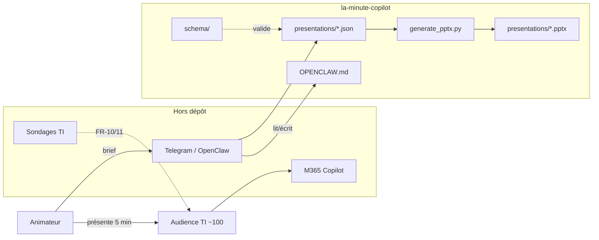

# Architecture — La minute Copilot

Document de décisions techniques pour assurer une implémentation cohérente par les agents IA (Cursor, OpenClaw) et les humains.

---

## Project Context Analysis

### Requirements Overview

**Functional Requirements (PRD) — 11 FR, 3 blocs :**

| Bloc | FR | Implication architecturale |
|------|-----|---------------------------|
| Série (audience) | FR-1 à FR-7 | Contrat JSON + rendu PPTX ; notes présentateur ; règles éditoriales dans le contenu, pas dans le code |
| Saison | FR-8, FR-9 | Fichiers par épisode ; pas de base de données — calendrier et file éditoriale hors repo ou en métadonnées JSON |
| Mesure | FR-10, FR-11 | Sondages **hors** du dépôt (Teams/forms) ; le repo ne les héberge pas |
| Production | §4.4 existant | Chaîne Brief → JSON → `generate_pptx.py` ; OpenClaw en amont |

**Non-functional requirements :**

| NFR | Approche |
|-----|----------|
| Simplicité / brownfield | Pas de service déployé ; CLI locale |
| Reproductibilité | JSON versionné ; PPTX régénérable |
| Cohérence visuelle | Constantes Desjardins + schéma dans `generate_pptx.py` |
| Sécurité / conformité | Pas de PII dans les JSON ; validation contenu = processus humain (animateur) |
| Maintenabilité agents | `project-context.md`, `OPENCLAW.md`, ce document |
| i18n | Français (QC) dans tout le contenu généré |

**Scale & complexity :**

- **Domaine :** outil CLI de génération de documents + pipeline éditorial assisté par agent
- **Complexité :** **faible à moyenne** (pas de multi-tenant, pas de temps réel, pas d’API)
- **Composants logiques :** 4 — Schéma, Contenu (JSON), Moteur de rendu, Agent producteur (OpenClaw)

### Technical Constraints & Dependencies

- Python ≥ 3.11, `python-pptx` ≥ 1.0
- `rsvg-convert` (librsvg) optionnel mais recommandé pour icônes Lucide
- OpenClaw : machine locale animateur, Telegram, accès lecture/écriture dépôt
- Lucide static CDN `0.469.0` (constante dans `lucide_icons.py`)
- M365 / Copilot : hors dépôt (sujet des épisodes uniquement)

### Cross-Cutting Concerns

- **Validation JSON** — schéma unique source de structure
- **Séparation contenu / présentation** — jamais éditer le PPTX à la main
- **Charte graphique** — centralisée dans le générateur
- **Guidage agents** — docs à la racine et `_bmad-output/`

---

## Starter Template Evaluation

### Primary Technology Domain

**Brownfield — pas de nouveau starter.** Le dépôt existant *est* la fondation.

### Selected Foundation: dépôt `la-minute-copilot` actuel

**Rationale :** PRD v1 exige seulement l’usage de la chaîne existante ; le générateur et 6 épisodes sont déjà en place.

**Équivalent « commande d’initialisation » pour un clone neuf :**

```bash
git clone <repo> la-minute-copilot && cd la-minute-copilot
uv venv --python 3.11 && uv sync
brew install librsvg   # macOS — icônes
./generate.sh presentations/outlook.json
```

**Décisions déjà prises par le codebase :**

| Zone | Décision |
|------|----------|
| Langage | Python 3.11+ |
| Rendu slides | python-pptx, layout blank index 6 |
| Config dépendances | `pyproject.toml` + `uv` / pip |
| Contenu | JSON UTF-8 dans `presentations/` |
| Icônes | Lucide SVG → PNG cache `assets/icons/cache/` |
| Thème | Palette Desjardins codée en dur dans `generate_pptx.py` |

---

## Core Architectural Decisions

### Decision Priority Analysis

**Critical (bloquent la cohérence) :**

1. JSON conforme à `schema/la-minute-copilot.schema.json` avant génération PPTX  
2. Un épisode = un fichier `presentations/<slug>.json` (+ PPTX généré)  
3. OpenClaw lit `OPENCLAW.md` + schéma ; ne modifie pas `generate_pptx.py` sans besoin produit  

**Important (qualité / évolution) :**

4. Validation CI avec `check-jsonschema` sur `presentations/*.json` (recommandé post-v1, voir README)  
5. Bump `LUCIDE_VERSION` coordonné avec tests sur un épisode icônes  

**Deferred (post-v1 PRD) :**

- Portail self-service sujets / métadonnées personas dans JSON  
- Automatisation Telegram → commit  
- Tests unitaires du moteur de rendu  

### Data Architecture

| Décision | Choix | Rationale |
|----------|-------|-----------|
| Stockage | Fichiers Git | Pas de volume de données ; diff review sur JSON |
| Modèle de données | JSON Schema `la-minute-copilot.schema.json` | Validation outillée ; auto-complétion IDE |
| Versioning épisodes | Git history | Source de vérité |
| PPTX | Artefacts générés (gitignore ou commit optionnel) | Régénérables depuis JSON |
| État saison / sondages | Hors repo | FR-10/11 — outils M365 du département |

### Authentication & Security

| Décision | Choix | Rationale |
|----------|-------|-----------|
| Auth applicative | N/A | Pas de serveur |
| Secrets | Aucun dans le repo | Pas d’API keys pour le générateur |
| Contenu épisodes | Exemples fictifs ou génériques | Institution financière — pas de données client |
| OpenClaw | Accès local dépôt ; confiance animateur | Périmètre personnel / machine locale |

### API & Communication

| Décision | Choix | Rationale |
|----------|-------|-----------|
| API HTTP | Aucune | CLI uniquement |
| Entrée humaine → agent | Telegram (OpenClaw) | Hors architecture repo |
| Entrée machine | Fichiers JSON + `./generate.sh` | Reproductible |
| Sortie | Fichier `.pptx` sur disque | Présentation Teams/présentiel |

### Infrastructure & Deployment

| Décision | Choix | Rationale |
|----------|-------|-----------|
| Hébergement | N/A (outil local) | Pas de déploiement cloud du générateur |
| CI | GitHub Actions `check-jsonschema` (documenté README, à activer) | Valide FR-6 indirectement |
| Environnement dev | `.venv` via `generate.sh` | uv ou pip |
| Distribution | Git clone + instructions README | ~100 viewers n’installent pas le générateur |

### Decision Impact Analysis

**Séquence d’implémentation recommandée :**

1. Activer workflow CI validation JSON (si pas déjà fait)  
2. Enrichir file éditoriale (OQ-5 PRD) — peut rester dans PRD ou `presentations/ROADMAP.md` futur  
3. Nouveaux épisodes via OpenClaw + revue animateur  
4. Évolutions schéma / générateur seulement quand nouveau `type` de slide requis  

**Dépendances :**

```
OPENCLAW.md + schéma  →  JSON épisode  →  generate_pptx.py  →  PPTX
                              ↑
                        project-context.md (règles code)
```

---

## Implementation Patterns & Consistency Rules

### Naming Patterns

| Artefact | Convention | Exemple |
|----------|------------|---------|
| Fichier JSON épisode | kebab-case | `prompts-avances.json` |
| Fichier PPTX sortie | `La_Minute_Copilot_<Sujet>.pptx` | `La_Minute_Copilot_Outlook.pptx` |
| Icône Lucide | kebab-case | `message-square` |
| Couleur carte | `green`, `amber`, `blue`, `red` | `blue` → vert Desjardins au rendu |
| Fonctions Python | `snake_case` module-level | `render_tips`, `add_card` |
| Constantes palette | `SCREAMING_SNAKE` | `DESJARDINS_GREEN` |

### Structure Patterns

- **Nouveau contenu** → `presentations/<slug>.json` uniquement  
- **Nouveau type de slide** → schéma + `RENDERERS` + `render_*` dans `generate_pptx.py`  
- **Nouvelle icône** → nom Lucide valide ; cache auto sous `assets/icons/cache/`  
- **Docs agents** → `OPENCLAW.md` (production épisode), `project-context.md` (code)  

### Format Patterns

- JSON : UTF-8, `$schema` en tête recommandé  
- Dates épisode : ISO `YYYY-MM-DD`  
- `speaker_notes` : français, style oral « Accueil : », « Démo : »  
- Texte slide : sans émojis (nettoyage `clean_text()`)  

### Process Patterns

| Étape | Responsable | Action |
|-------|-------------|--------|
| Brief | Animateur | Topic + use cases → Telegram |
| Rédaction JSON | OpenClaw | Suivre `OPENCLAW.md` |
| Revue | Animateur | Ton, conformité, pas de PII |
| Validation | Animateur ou CI | `check-jsonschema` |
| Build | Animateur ou script | `./generate.sh presentations/<file>.json` |
| Présentation | Animateur | Session 5 min |

### Enforcement — agents MUST

- Lire `project-context.md` avant de modifier `scripts/` ou `schema/`  
- Lire `OPENCLAW.md` avant de créer/modifier un JSON d’épisode  
- Ne pas promouvoir de LLM hors Copilot dans le contenu  
- Valider le JSON contre le schéma avant de proposer un commit  

### Anti-Patterns

- Éditer `.pptx` pour le texte  
- Ajouter un `slide.type` sans schéma + renderer  
- Inventer des noms d’icônes Lucide  
- Dupliquer la palette hors constantes `generate_pptx.py`  

---

## Project Structure & Boundaries

### Complete Project Directory Structure

```
la-minute-copilot/
├── OPENCLAW.md                 # Guide agent production JSON
├── README.md                   # Humains + BMAD + commandes
├── generate.sh                 # Entry: venv + generate_pptx.py
├── pyproject.toml
├── schema/
│   └── la-minute-copilot.schema.json   # Contrat données épisode
├── presentations/
│   ├── *.json                  # Source de vérité (épisodes)
│   └── *.pptx                  # Générés (souvent gitignored)
├── scripts/
│   ├── generate_pptx.py        # Moteur rendu + RENDERERS
│   └── lucide_icons.py         # CDN Lucide → PNG cache
├── assets/icons/cache/         # PNG générés (gitignored)
├── prompts/                    # Archive (hors pipeline épisode)
├── _bmad-output/
│   ├── project-context.md
│   └── planning-artifacts/
│       ├── architecture.md     # Ce document
│       └── prds/.../prd.md
└── .agents/skills/             # BMAD Cursor (hors runtime épisode)
```

### Architectural Boundaries



| Boundary | Dedans | Dehors |
|----------|--------|--------|
| Contenu pédagogique | `presentations/*.json` | Slides PowerPoint manuelles |
| Rendu visuel | `scripts/generate_pptx.py` | PowerPoint UI |
| Product discovery | PRD `_bmad-output/...` | — |
| Mesure impact | — | Sondages département |
| IDE agent Cursor | `.agents/skills/` | OpenClaw (runtime séparé) |

### FR → Structure Mapping

| FR / capacité | Emplacement |
|---------------|-------------|
| FR-1 à FR-7 (format série) | `presentations/*.json` + `speaker_notes` ; rendu `generate_pptx.py` |
| FR-6 (structure visuelle) | `schema/` + `RENDERERS` |
| FR-8 (saison 25 ép.) | Processus + file § PRD ; fichiers JSON multiples |
| FR-9 (Copilot only) | Règles éditoriales JSON ; `OPENCLAW.md` |
| FR-10/11 (sondages) | Hors repo |
| Chaîne OpenClaw | `OPENCLAW.md`, `addendum.md` (PRD), Telegram |
| CI validation | `.github/workflows/` (à créer si absent) → `presentations/*.json` |

### Integration Points

| Integration | Type | Notes |
|-------------|------|-------|
| OpenClaw ↔ Git repo | Fichiers | Écriture `presentations/<slug>.json` |
| Lucide CDN | HTTP GET | `unpkg.com/lucide-static@0.469.0` |
| rsvg-convert | Sous-processus local | Rasterisation PNG |
| GitHub (optionnel) | CI | `check-jsonschema` |

---

## Architecture Validation Results

### Coherence Validation ✅

- Stack homogène Python + fichiers ; pas de conflit technologique  
- OpenClaw et Cursor partagent les mêmes contrats (schéma, docs)  
- PRD v1 « production existante » aligné avec §4.4 et ce document  

### Requirements Coverage Validation ✅

| Exigence | Couverture |
|----------|------------|
| FR-1 à FR-11 | JSON + processus + docs ; sondages explicitement hors repo |
| Personas P1–P3 | Éditorial dans JSON ; pas de couche logicielle séparée |
| UJ-4 OpenClaw | Documenté dans boundaries + `OPENCLAW.md` |

### Implementation Readiness ✅

- Agents peuvent produire un épisode sans ambiguïté structurelle  
- Gaps mineurs : CI peut être absent du repo ; workflow à ajouter si souhaité  

### Gap Analysis

| Priorité | Gap | Action suggérée |
|----------|-----|-----------------|
| Important | CI `validate-json` peut ne pas exister encore | Ajouter `.github/workflows/validate-json.yml` (QQ) |
| Important | Pas de `presentations/ROADMAP.md` pour 19 sujets restants | Fichier léger ou tableau PRD |
| Nice | Tests unitaires `clean_text`, layout | Post-v1 |
| Nice | Métadonnée `personas: [P1,P2]` dans JSON | Extension schéma optionnelle |

### Architecture Completeness Checklist

**Requirements Analysis**

- [x] Project context thoroughly analyzed
- [x] Scale and complexity assessed
- [x] Technical constraints identified
- [x] Cross-cutting concerns mapped

**Architectural Decisions**

- [x] Critical decisions documented with versions
- [x] Technology stack fully specified
- [x] Integration patterns defined
- [x] Performance considerations addressed (CLI local, cache icônes)

**Implementation Patterns**

- [x] Naming conventions established
- [x] Structure patterns defined
- [x] Communication patterns specified
- [x] Process patterns documented

**Project Structure**

- [x] Complete directory structure defined
- [x] Component boundaries established
- [x] Integration points mapped
- [x] Requirements to structure mapping complete

### Architecture Readiness Assessment

**Overall Status:** READY WITH MINOR GAPS (CI workflow optionnel non vérifié dans le dépôt)

**Confidence Level:** High — brownfield simple, PRD et code alignés

**Key Strengths:** Séparation JSON/PPTX claire ; docs agents (`OPENCLAW.md`, `project-context.md`) ; schéma formalisé

**Areas for Future Enhancement:** CI JSON ; métadonnées persona par épisode ; tests rendu

### Implementation Handoff

**AI Agent Guidelines:**

- Suivre ce document + `project-context.md` + `OPENCLAW.md`  
- Toute extension du schéma = migration des 6 épisodes existants ou compatibilité ascendante  

**First implementation priority (post-architecture):**

1. `[CE]` `bmad-create-epics-and-stories` — saison, CI validation, nouveaux épisodes  
2. Ou `[QQ]` — ajouter le workflow GitHub `check-jsonschema` du README  

---

## Prochaines étapes BMad

| Code | Skill | Quand |
|------|-------|-------|
| **[CE]** | `bmad-create-epics-and-stories` | **Recommandé maintenant** — découper FR en stories |
| **[IR]** | `bmad-check-implementation-readiness` | Après epics, avant sprint dev |
| **[CU]** | `bmad-create-ux-design` | Optionnel — pas d’app UI ; format slide déjà fixé |
| **[BH]** | `bmad-help` | Réorientation |
